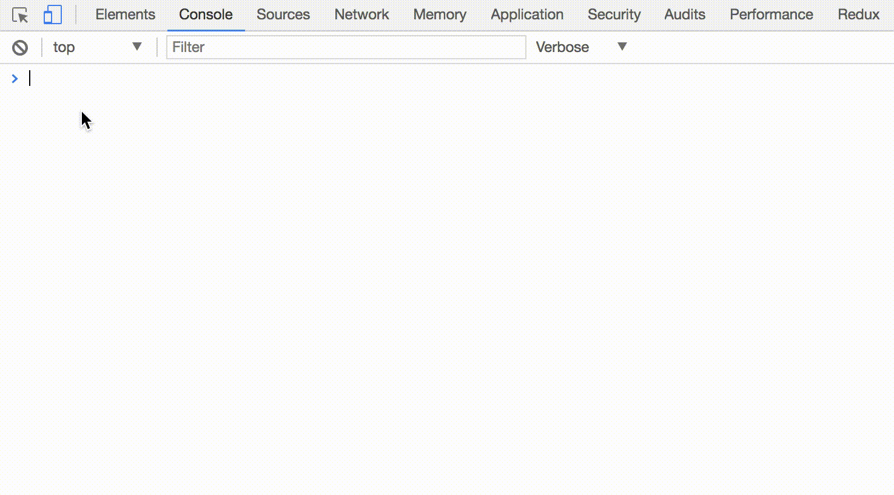

# console.img [](https://github.com/prettier/prettier) [](https://github.com/sindresorhus/xo)

> Display a picture in the Chrome browser console

[](https://npmjs.com/package/console.img) [](https://npmjs.com/package/console.img)



## Install

```bash
yarn add console.img
```

## Usage

```js
var script = document.createElement('script')
script.src = '//unpkg.com/console.img/dist/console.img.min.js'
script.onload = () =>
  console.img('http://image.diyidan.net/post/2015/11/8/kreGswFTYGFVgWjF.gif')
document.body.appendChild(script)
```

## CDN

* [unpkg](//unpkg.com/console.img/dist/console.img.min.js)
* [jsDelivr](//cdn.jsdelivr.net/npm/console.img/dist/console.img.min.js)
* [bundle.run](//bundle.run/console.img)

## Contributing

1. Fork it!
2. Create your feature branch: `git checkout -b my-new-feature`
3. Commit your changes: `git commit -am 'Add some feature'`
4. Push to the branch: `git push origin my-new-feature`
5. Submit a pull request :D

## Author

**console.img** © [u3u](https://github.com/u3u), Released under the [MIT](./LICENSE) License.<br>
Authored and maintained by u3u with help from contributors ([list](https://github.com/u3u/console.img/contributors)).

> [quq.cat](https://quq.cat) · GitHub [@u3u](https://github.com/u3u)
